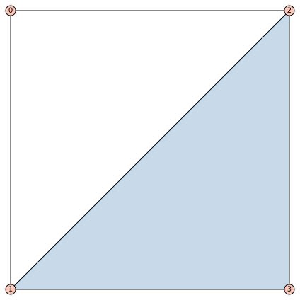
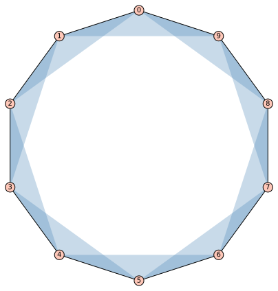
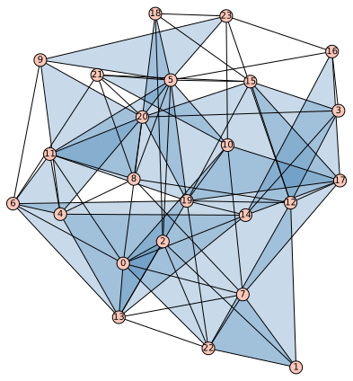

# higher-order-contagion
Code for learning pairwise and higher-order rates of complex contagion on higher-order networks using birth-and-death processes.

Higher-order networks can be represented by various structures including simplicial complexes and general hypergraphs. Here, we focus on simplicial complexes where the highest dimension of interaction is two. 

Nevertheless, the framework is extendable to higher dimensions and to general hypergraphs.

### Examples
Example of a higher-order network on 4 nodes with 6 edges: five 2-node edges and one 3-node hyperedge:
```python
from higher_order_structures import HigherOrderStructure
from utils import draw_hypergraph

g = HigherOrderStructure(4)
g.name = "Higher Order Example"
edges = [(0, 1), (1, 2), (2, 0), (2, 3), (3, 1), (1, 2, 3)]
g.set_edges(edges)

positions = {0: (0, 1), 1: (0, 0), 2: (1, 1), 3: (1, 0)}
file_name = "../figures/higher_order_structures/ho_example.svg"
draw_hypergraph(g, pos=positions, fname=file_name)
```


### Cycle hypergraph
Example of a cycle / ring hypergraph on 10 nodes:
```python
N = 10
g = HigherOrderStructure(N)
g.name = "Cycle Hypergraph"
edges = []
for i in range(N):
    # 2-node edges form a cycle
    j = (i + 1) % N
    edges.append((i, j))
    # 3-node edges form a cycle
    k = (i + 2) % N
    edges.append((i, j, k))
g.set_edges(edges)
file_name = "../figures/higher_order_structures/ho_cycle_hypergraph.svg"
draw_hypergraph(g, fname=file_name)
```


### Erdos-Renyi like simplicial complex
```python
from higher_order_structures import ErdosRenyiSC
# parameters for a small example
N_example = 24
d1_target_example = 6.0 # average pairwise degree
d2_target_example = 2.0 # average higher-order degree
g_sc = ErdosRenyiSC(N_example, d1_target_example, d2_target_example)
g_sc.summary()
# Target d1: 6.00, Realized d1: 7.17
# Target d2: 2.00, Realized d2: 2.38

# Target p1:  0.26086957, Realized p1: 0.31159420
# Target p2:  0.00790514, Realized p2: 0.00938735

# Initial p_G used for G(N, p_G): 0.11986219

# Realized number of pw edges:  86/276
# Realized number of ho edges:  19/2024

# Is valid SC: True
```


TODO: add examples of 3 main classes of simplicial complexes, more heterogeneous E-R SC, regular, and generalized scale-free, maybe the star graph too.

## Installation
```bash
# Clone repository
git clone https://github.com/markolalovic/higher-order-contagion.git
cd higher-order-contagion

# Set up virtual environment
python3 -m venv .venv
source .venv/bin/activate
python3 -m pip install --upgrade pip

# Install dependencies
python3 -m pip install -r requirements.txt
```

### Minimal dependencies
```bash
# For the main / core functionality
python3 -m pip install numpy scipy birdepy

# For plotting results and data handling
python3 -m pip install matplotlib pandas

# To run the Jupyter notebooks install:
python3 -m pip install jupyterlab notebook ipykernel

# And add the virtual environment as a kernel
ipython kernel install --user --name .venv

# For testing
python3 -m pip install pytest
```

### Optional dependencies
For running Mathematica scripts (`.wls`) and notebooks install: [Wolfram Engine kernel](https://www.wolfram.com/engine/index.php.en). 

For hypergraph drawings install: [SageMath](https://www.sagemath.org/).