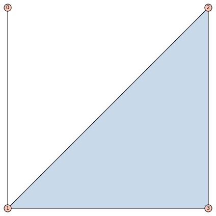

# higher-order-contagion
This repository contains code for learning pairwise and higher-order rates of complex contagion on higher-order networks using birth-and-death processes.

We model higher-order networks using hypergraphs.

## Examples
Example of a hypergraph on 4 nodes with four 2-node edges and one 3-node edge:
```python
from Hypergraphs import EmptyHypergraph
from utils import draw_hypergraph

# a hypergraph on 4 nodes with 5 edges
g = EmptyHypergraph(4)
g.name = "Example Hypergraph"
edges = [(0, 1), (1, 2), (2, 3), (3, 1), (1, 2, 3)]
g.set_edges(edges)
g.print()

# set node positions, node labels, and draw hypergraph
positions = {0: (0, 1), 1: (0, 0), 2: (1, 1), 3: (1, 0)}
labels = {0: "a", 1: "b", 2: "c", 3: "d"}
draw_hypergraph(g, pos=positions, lab=labels)
```


Example of a cycle / ring hypergraph on 10 nodes:
```python
N = 10
g = EmptyHypergraph(N)
g.name = "Cycle Hypergraph"

edges = []
for i in range(N):
    # 2-node edges form a cycle
    j = (i + 1) % N
    edges.append((i, j))
    
    # 3-node edges form a cycle
    k = (i + 2) % N
    edges.append((i, j, k))

g.set_edges(edges)
draw_hypergraph(g)
```


## How-to
To run the code, first clone the repository:
```bash
git clone https://github.com/markolalovic/higher-order-contagion.git
cd higher-order-contagion
```

Then set up a virtual environment and install dependencies:
```bash
python3 -m venv .venv
source .venv/bin/activate
python3 -m pip install --upgrade pip
python3 -m pip install -r requirements.txt
```

Alternatively, you can install dependencies individually. For the main parts you only need:
```bash
python3 -m pip install numpy scipy
```

For plotting results and data handling:
```bash
python3 -m pip install matplotlib pandas
```

To run the Jupyter notebooks, install also:
```bash
python3 -m pip install jupyterlab notebook ipykernel
```

and add the virtual environment as a kernel:
```bash
ipython kernel install --user --name .venv
```

To run the tests install:
```bash
python3 -m pip install pytest
```

Optionally, to run notebooks and scripts (`.wls`) written in Mathematica, you'll need the [Wolfram Engine kernel](https://www.wolfram.com/engine/index.php.en). 

For visualizing graphs and hypergraphs, you can install [SageMath](https://www.sagemath.org/).

