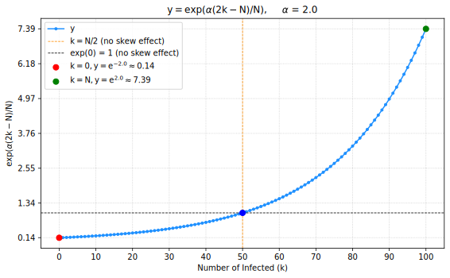

## Models used to fit empirical infection rate curves $\widetilde{a}_k$ and $\widetilde{b}_k$

Generalized model fits, inspired by Di Lauro et al. "Network inference from population-level observation of epidemics." Scientific Reports 10.1 (2020): 18779.

To get the approximate functional forms for state-dependent infection rates, let

$$
\widetilde{a}_k = C_a \cdot k^{p_a} \cdot (N - k)^{p_a} 
\cdot \exp\left(\alpha_a \frac{2k - N}{N}\right) 
$$

$$
\widetilde{b}_k = C_b \cdot k \cdot (k - 1)^{p_b} 
\cdot (N-k)^{p_b} \cdot \exp\left(\alpha_b \frac{2k - N}{N}\right)
$$

where:

- $C > 0$ is the scaling parameter

- $p > 0$ controls the shape, the rise and fall, how sharp the transitions are

- $\alpha$ controls the skewness

To get the $\widetilde{a}$, $\widetilde{b}$ curves, we find the values of $(C_a, p_a, \alpha_a)$, and $(C_b, p_b, \alpha_b)$ using non-linear least squares with the `curve_fit` function from the `scipy.optimize` library in Python.

With bounds for the parameter: $C_a, C_b \ge 0$, and $p_a, p_b > 0$.

The models are implemented in functions `di_lauro_ak_model`, `di_lauro_bk_model` in `./src/estimate_total_rates.py`.

Fitting is done in `./scripts/estimates_export.py`.

## How to justify this choice:

- Term $C k (N - k)$ gives basic parabolic shape for $\widetilde{a}_k$ (pairwise infection rate)

- Term $C k (k - 1) (N - k)$ gives cubic shape for $\widetilde{b}_k$ (higher-order infection rate)

- The power exponents $p_{a}, p_{b}$ introduce some non-linear modulation of these shapes

- The last factor $\exp(\alpha (2k - N) / N)$ introduces skewness

- In particular, for the skewness factor:
  - The term $(2k - N) / N$, which is $(k - N/2)/(N/2)$ just maps $[0, N]$ to $[-1, 1]$

  - If $\alpha$ is positive, i.e. $\alpha > 0$, the curve is enhanced for $k > N/2$:

  - This means that, if fitted value of $\alpha$ is positive, this will result in skewed empirical curve, which is called negative skewed, i.e. long tail on the left.

  - And if $\alpha$ is negative, i.e. $\alpha > 0$, the curve is enhanced for $k > N/2$:

  - This means that, if fitted value of $\alpha$ is negative, this will result in skewed empirical curve, which is called positive skewed, i.e. long tail on the right.
